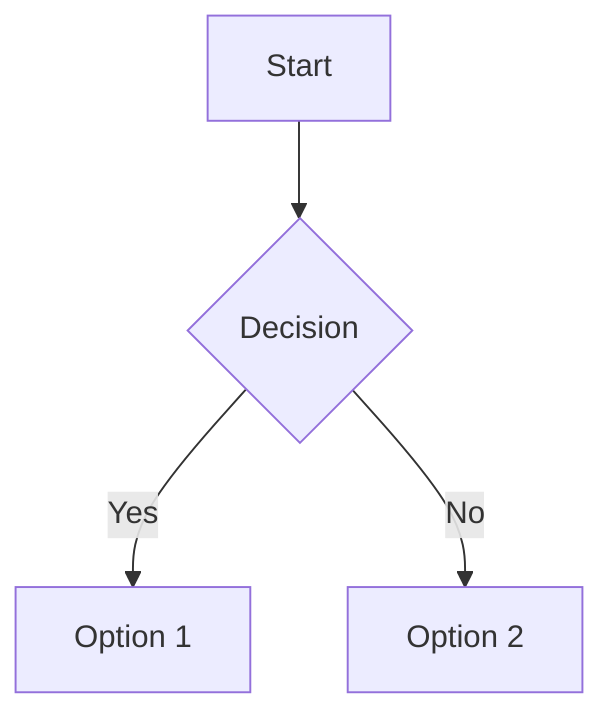
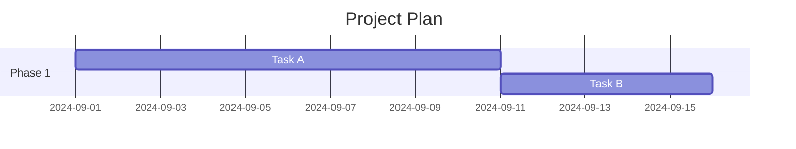
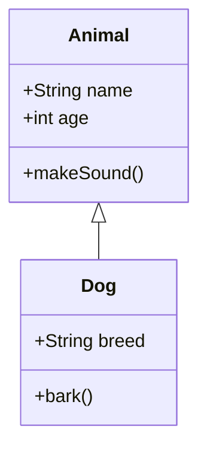
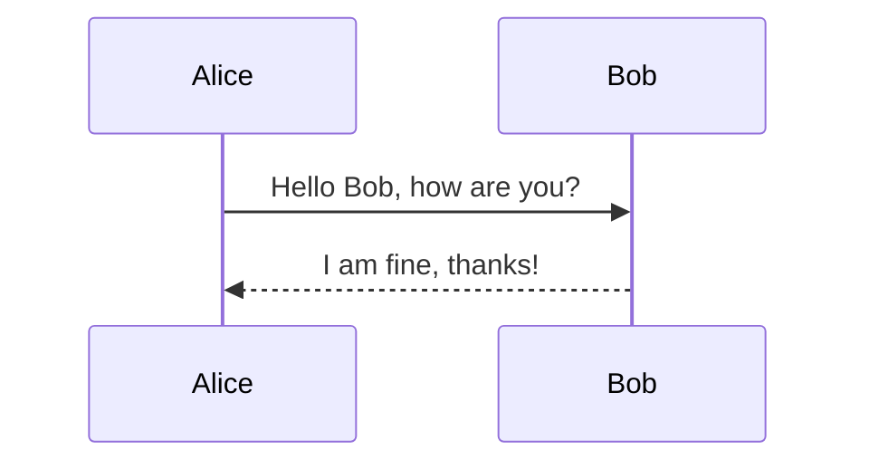
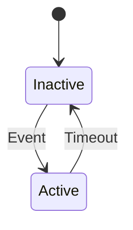
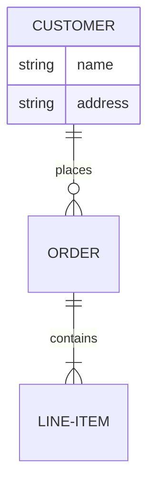
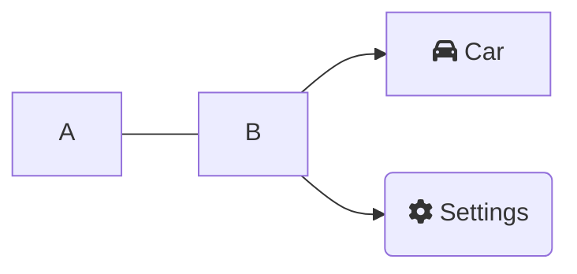
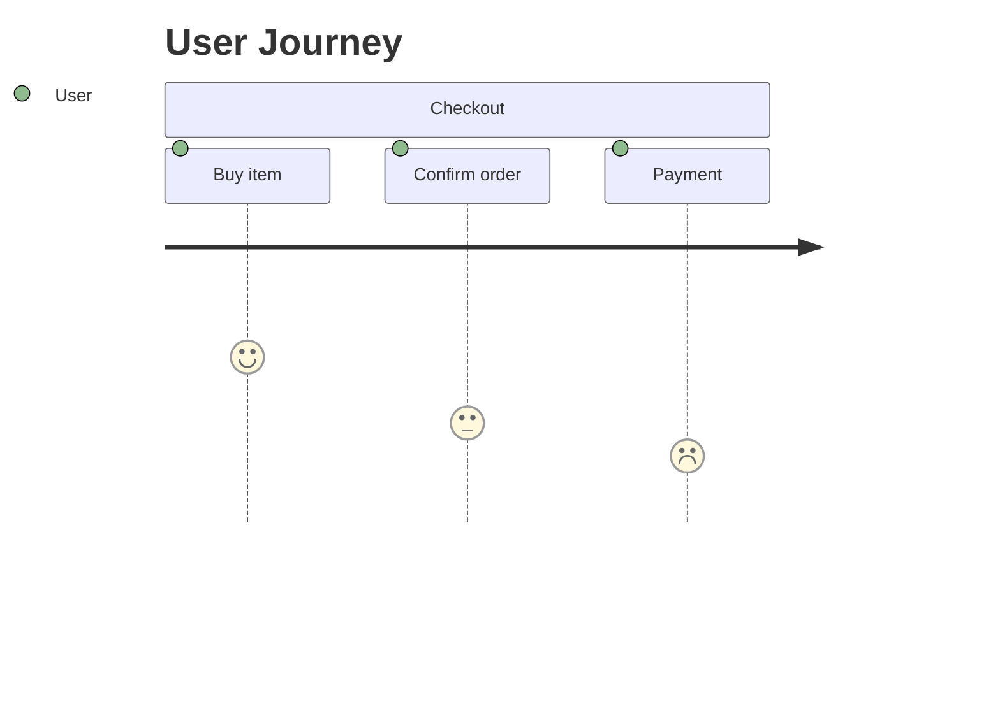
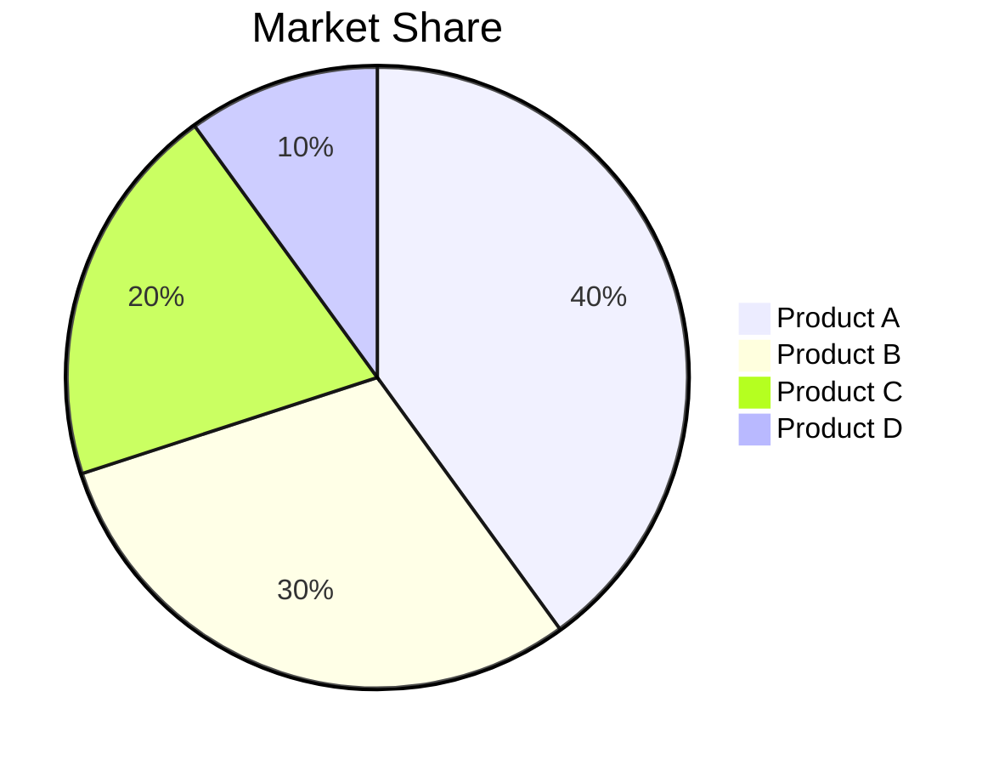

Mermaid es una herramienta poderosa que permite crear una gran variedad de diagramas mediante una sintaxis sencilla en texto. A continuación, se presenta una lista de los tipos de diagramas que se pueden hacer con Mermaid:

### 1. **Diagramas de flujo (Flowcharts)**
- **Dirección de arriba a abajo** (`TB`)
- **Dirección de izquierda a derecha** (`LR`)
- **Dirección de derecha a izquierda** (`RL`)
- **Dirección de abajo hacia arriba** (`BT`)

### 2. **Diagramas de Gantt (Gantt charts)**
- Representación de cronogramas de proyectos con tiempos, dependencias y tareas.

### 3. **Diagramas de Clases UML (UML Class Diagrams)**
- Representa clases y sus relaciones en un sistema orientado a objetos.

### 4. **Diagramas de Secuencia (Sequence Diagrams)**
- Muestra la interacción entre actores o componentes a lo largo del tiempo.

### 5. **Diagramas de Estado (State Diagrams)**
- Representa los diferentes estados de un objeto o sistema y las transiciones entre ellos.

### 6. **Diagramas de Tareas o Entidades (Entity Relationship Diagrams - ERD)**
- Modela las relaciones entre diferentes entidades en un sistema.

### 7. **Gráficos de Red (Network Diagrams)**
- Para mostrar redes de nodos interconectados.

### 8. **Diagramas de Matriz de Viajes (User Journey Diagrams)**
- Ilustra el viaje del usuario a través de diferentes fases o estados.

### 9. **Diagramas de Entidad-Relación (Entity Relationship Diagrams)**
- Describen entidades y sus relaciones en un sistema de bases de datos.

### 10. **Diagramas de Tareas (Task Diagrams)**
- Muestra tareas y su progreso o estado de completitud.

### 11. **Gráficos de Párrafo (Pie Charts)**
- Representa datos proporcionales en forma de gráfica circular.

Mermaid es bastante flexible, por lo que admite personalización y expansión de sus diagramas con diferentes estilos, enlaces y más elementos.