### 1. **Diagramas de flujo (Flowcharts)**
- **Dirección de arriba a abajo** (`TB`)
- **Dirección de izquierda a derecha** (`LR`)
- **Dirección de derecha a izquierda** (`RL`)
- **Dirección de abajo hacia arriba** (`BT`)

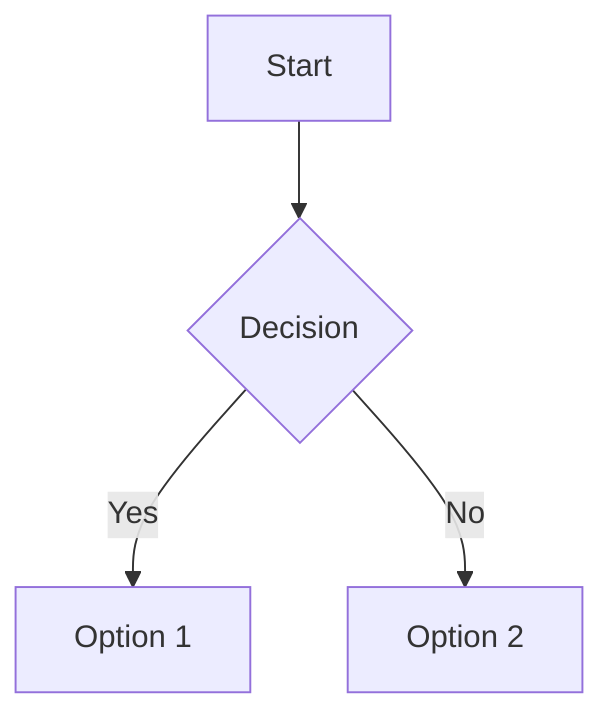

### 2. **Diagramas de Gantt (Gantt charts)**
- Representación de cronogramas de proyectos con tiempos, dependencias y tareas.

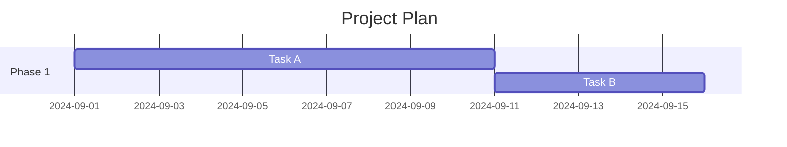

### 3. **Diagramas de Clases UML (UML Class Diagrams)**
- Representa clases y sus relaciones en un sistema orientado a objetos.

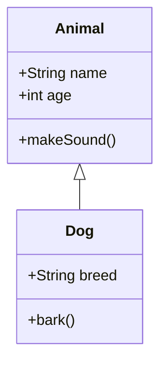

### 4. **Diagramas de Secuencia (Sequence Diagrams)**
- Muestra la interacción entre actores o componentes a lo largo del tiempo.

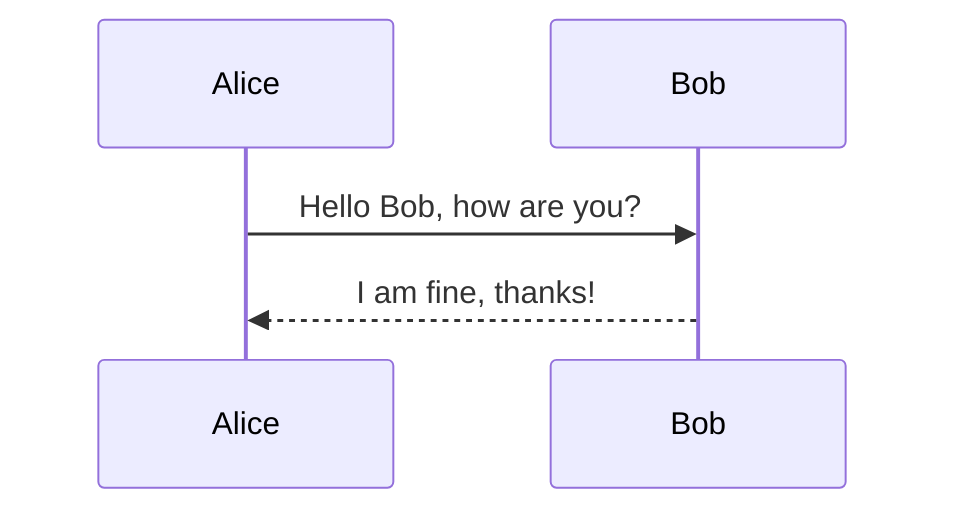

### 5. **Diagramas de Estado (State Diagrams)**
- Representa los diferentes estados de un objeto o sistema y las transiciones entre ellos.

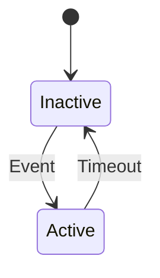

### 6. **Diagramas de Entidad-Relación (ERD)**
- Modela las relaciones entre diferentes entidades en un sistema.

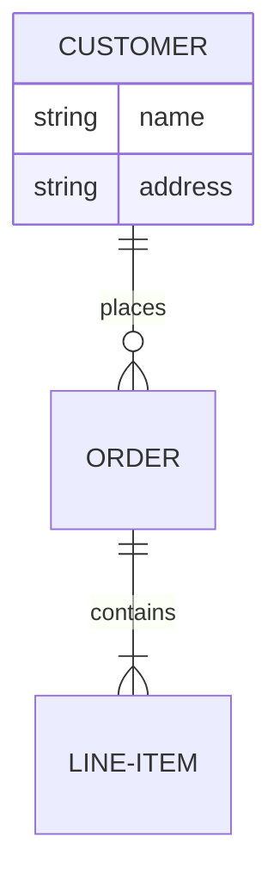

### 7. **Gráficos de Red (Network Diagrams)**
- Muestra redes de nodos interconectados.

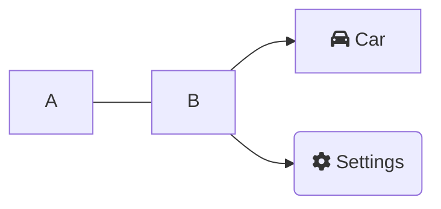

### 8. **Diagramas de Matriz de Viajes (User Journey Diagrams)**
- Ilustra el viaje del usuario a través de diferentes fases o estados.

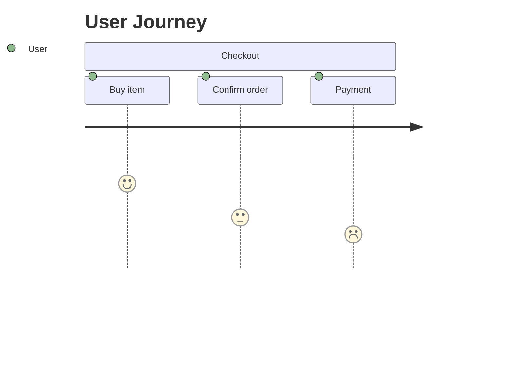

### 9. **Gráficos de Tarta (Pie Charts)**
- Representa datos proporcionales en forma de gráfica circular.

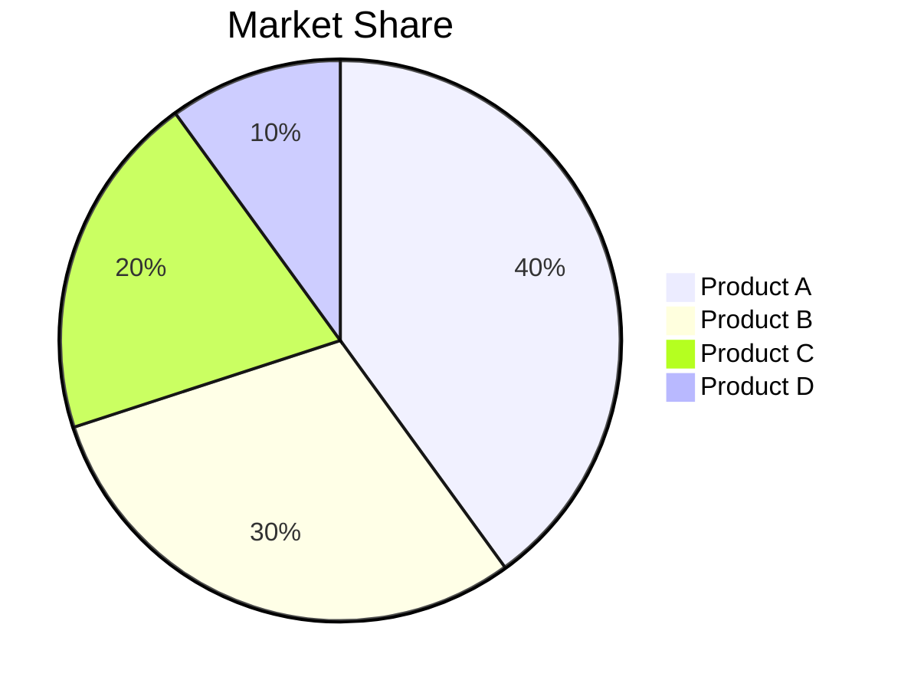

### 10. **Diagramas de Tareas (Task Diagrams)**
- Representa tareas y su progreso o estado de completitud.

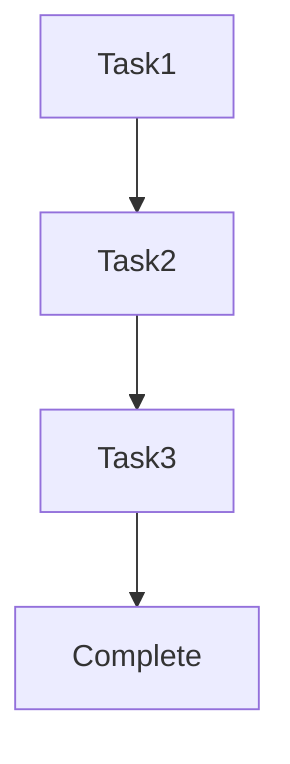

### 11. **Diagramas de Colaboración (C4 Diagrams)**
- Modela componentes, contenedores y relaciones en sistemas distribuidos o microservicios.

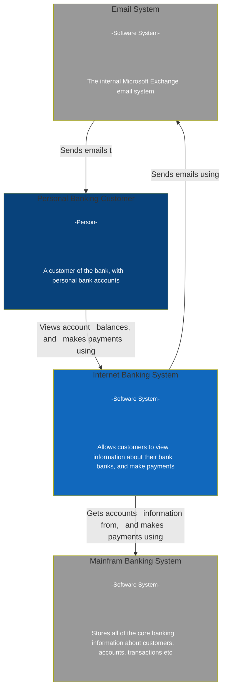

### 12. **Diagramas de Tubería (Pipeline Diagrams)**
- Representa el flujo de datos o procesos a través de un pipeline.

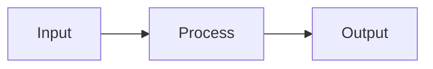

### 13. **Diagramas de Archivos y Carpetas (Git Graph)**
- Muestra visualmente la estructura y relaciones de carpetas y archivos, especialmente útil en proyectos Git.

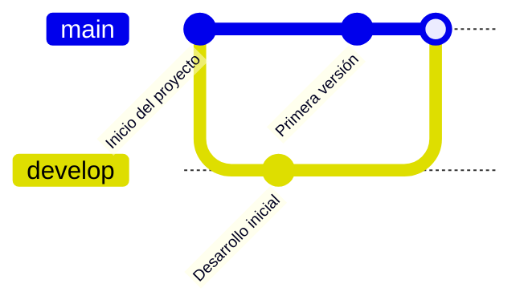

### 14. **Diagramas de Comparación (Quadrant Diagrams)**
- Organiza conceptos o elementos en cuadrantes para comparación según dos criterios.

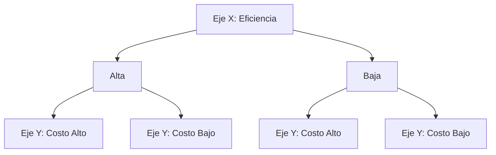

### 15. **Diagramas de Control de Flujo (State Diagrams)**
- Muestra los estados de un sistema o proceso y las transiciones entre esos estados.

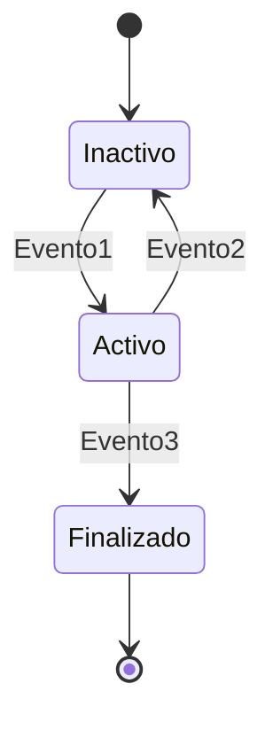

### 16. **Diagramas de Requisitos (Requirement Diagrams)**
- Representa las relaciones entre requisitos y los elementos que los cumplen.

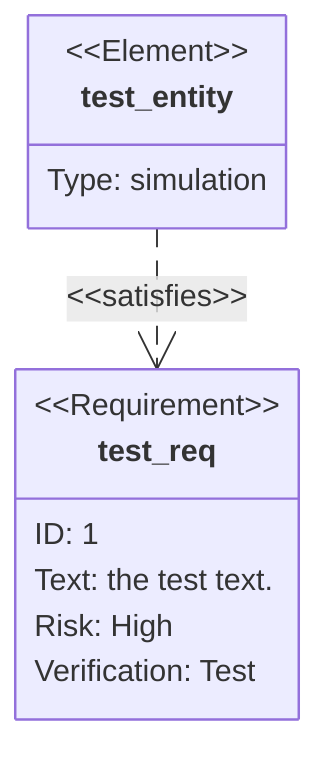

### 17. **Diagramas de Arquitectura de Software (C4: Container & Component Diagrams)**
- Se centra en la arquitectura de un sistema, modelando los componentes y contenedores.

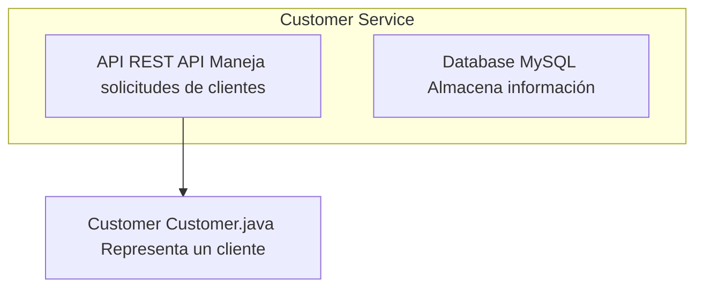

### 18. **Diagramas Con estilo personalizado**
- Se le puede aplicar clases para personalizar el diagrama

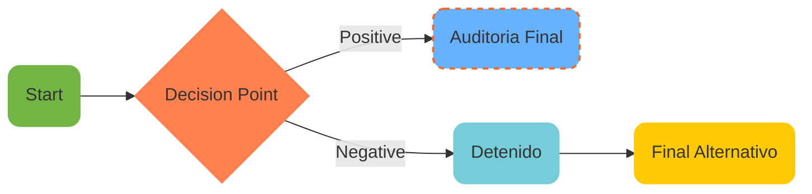

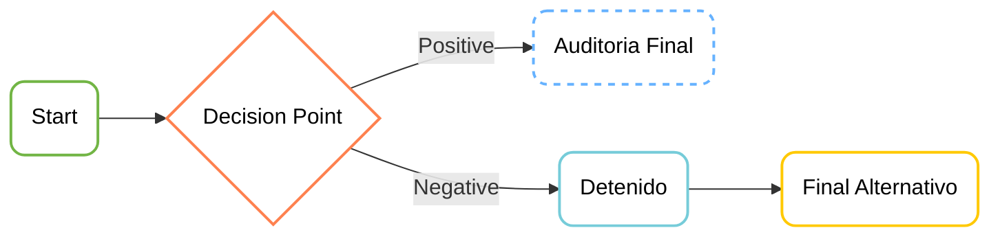

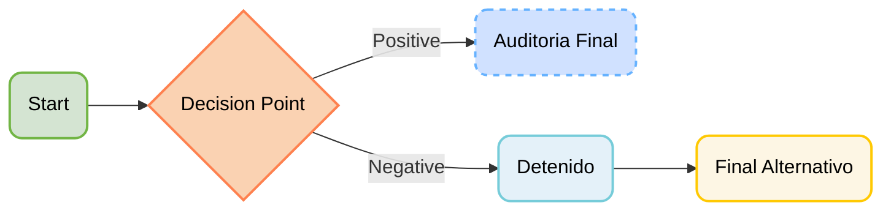
